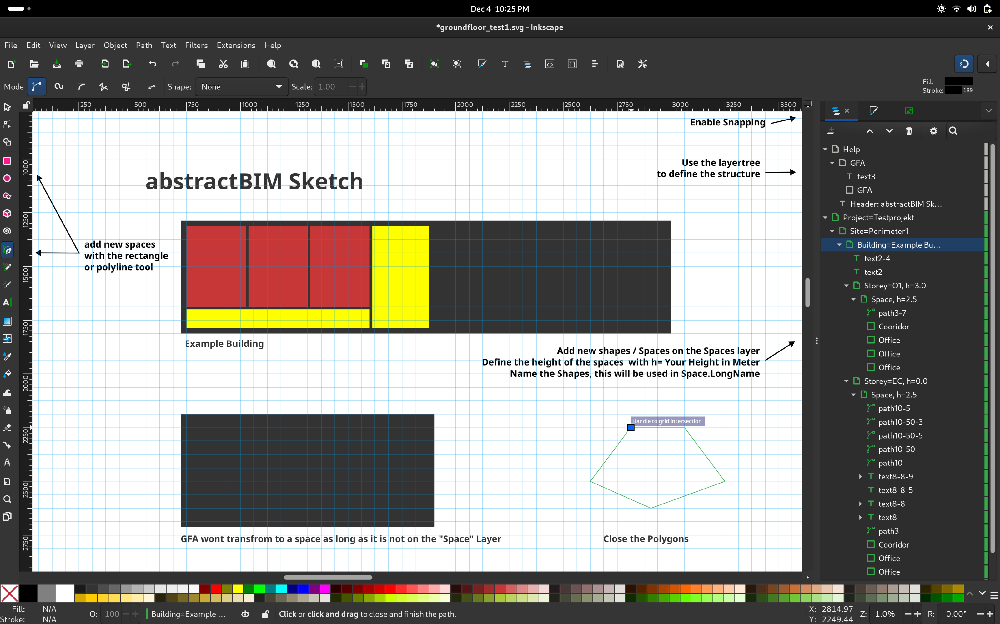

# abstractBIM Sketch (early Beta)

abstractBIM Sketch is an Inkscape plugin that bridges the gap between intuitive architectural sketching and Building Information Modeling (BIM). It enables architects and engineers to create and modify building information models using Inkscape - a userfriendly and free SVG drawing tool.




## Table of Contents

- [Background & Motivation](#background--motivation)
- [Features](#features)
- [Getting Started](#getting-started)
  - [Prerequisites](#prerequisites)
  - [Installation](#installation)
  - [Basic Usage](#basic-usage)
- [Inkscape Template Structure](#inkscape-template-structure)
  - [Layer Organization](#layer-organization)
  - [Grid Settings](#grid-settings)
- [Workflow](#workflow)
- [Current Limitations & Roadmap](#current-limitations--roadmap)
  - [In Progress / Planned](#in-progress)
  - [Future Development / Ideas](#future-development)
- [Contributing](#contributing)
- [License](#license)
- [Acknowledgments](#acknowledgments)
- [Contact](#contact)


## Background & Motivation

The project addresses a fundamental challenge in the BIM workflow:

- Traditional BIM doctrine emphasizes a single model approach where all stakeholders work with one model
- In practice, architects (primary modelers) may not fully understand or accommodate the needs of other stakeholders
- This leads to engineers, building physics, fire safety engineers and quantity surveyors reverting to traditional workflows, losing BIM benefits
- abstractBIM Sketch empowers stakeholders to leverage BIM data while working with familiar  userfriendly tools

## Features

- Fast modeling of spaces and converting these SVG drawings to IFC (Industry Foundation Classes) format
- Fast adding and remodeling existing spaces from a imported IFC Space model to SVG shapes while conserving the hirachical structure of the ifc
- Layer-based organization system (Project → Site → Building → Storey → Space)
- Support for multiple buildings within a project
- Precise measurement grid system (12.5cm raster)
- Height and metadata management for spaces

## Getting Started

### Prerequisites

- Python 3.9.20
- Inkscape (latest version recommended)
- Required Python packages:
  - ifcopenshell
  - svgpathtools
  - xml.etree.ElementTree

### Installation

1. Clone the repository:
```bash
git clone [repository-url]
cd abstractbim-sketch
```

2. Install required Python packages:
```bash
pip install -r requirements.txt
```

### Basic Usage

1. Start with the provided template.svg
2. Follow the standardized layer naming convention:
3. Draw spaces using rectangles or paths
4. Execute the converter script:

```bash
execute_svg_to_ifc.py
```

## Inkscape Template Structure

### Layer Organization
  - Project Layer: Project=Your Project Name
    - Site Layer: Site=Your Site Name
     - Building Layer: Building=Your Building Name
      - Storey Layer: Storey= Your Storey Name, Z=HeightValue 
        - Space Layer: Spaces, h=Height, relZ=RelativeHeight (TODO: Better handeling of spaces with different starting heights on one floor)
          - Add your Shapes here, the name will be the LongName in the IFC

### Grid Settings
- Base unit: Centimeters (cm)
- Default raster: 12.5cm
- Customizable grid options for precise drawing

## Workflow

1. Import reference material (IFC/DWG/PDF) into Inkscape
2. Create or modify spaces using SVG drawing tools
3. Organize content using the layer structure
4. Add metadata (heights, names, etc.)
5. Generate IFC output for BIM usage

## Current Limitations & Roadmap

### In Progress / Planned
- Import tests with different IFC files
- Handeling of spaces with a negative relZ (e.g. to model a void space)
- Update capability for existing IFC files
- Inkscape plugin packaging
- Direct "Send to abstractBIM" functionality
- Window and door support

### Done
- Extensive testing phase & Bugfixes
    - rotaed rectangles ... done
    - issue with transformations in second building ... done
    - issues with units ... done
- IFC importer development (IfcSpaces → SVG conversion) ... done

### Future Development Ideas
- Handeling more shapes besides rectangles and polylines
- Import room program from Excel
- Display Roomname, Target sqm and Actual sqm in the room shape
- Enhanced metadata handling
- Improved measurement tools
- Database integration
- Metadata visualization
- Custom menu bar
- Create a legend
- Support for additional SVG/DXF editors
- Web-based interface
- gbXML Import
- Buttons to create the entities, with XML Metadata preloded

## Contributing

We welcome contributions! Please see our [Contributing Guidelines](CONTRIBUTING.md) for details. But basicly it's contact me and we will figure it out.

## License

abstractBIM Sketch is licensed under the GNU General Public License v3.0 (GPL-3.0).

This means you are free to:
- Use the software for any purpose
- Change the software to suit your needs
- Share the software with your friends and neighbors
- Share the changes you make

For more details, see the [LICENSE](LICENSE) file in this repository or visit https://www.gnu.org/licenses/gpl-3.0.en.html

## Acknowledgments

- Inkscape development team
- IfcOpenShell community
- All contributors and testers

## Contact

simon.dilhas@abstractBIM.com